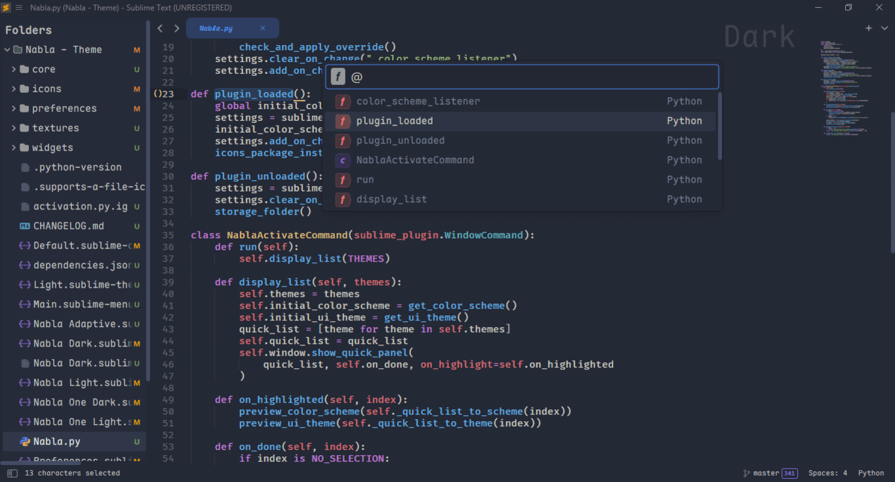
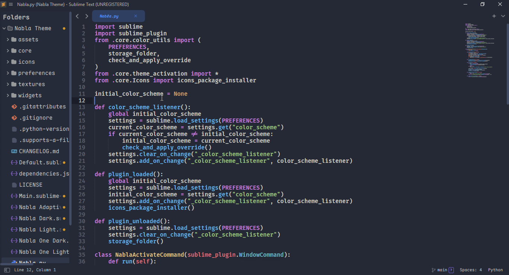

# Nabla Theme for Sublime Text

[](https://www.sublimetext.com/download)

[](LICENSE)

🎨A theme and color scheme for Sublime Text 4
Based on [Theme Treble](https://github.com/53v3n3d4/Theme-Treble)



> All screenshots use wonderful [Maple Mono](https://font.subf.dev/en/) font (NF version)


## Customization
For full theme settings and sublime text settings compatible, please take a look at the [SETTINGS.md](SETTINGS.md) page.


## Package installation

The recommended way to install is through [Package Control R](packages.sublimetext.io).  
1. Command Palette `Tools → Command Palette` or `Cmd/Ctrl + Shift + P`
2. Choose `Package Control: Install Package` 
3. Type `Nabla Theme` and press `ENTER`.


To install manually, download the latest release version zip file and uncompress it on your Sublime Text `Packages` folder.  
1. Download the zip file on [`releases`](https://github.com/aelmoghit/Nabla-Theme/releases) page
2. Unzip and rename the folder to `Nabla Theme`  
3. Menu `Preferences → Browse packages...` to open destination folder  
4. Copy the folder into `Packages` directory


## Uninstall

To remove package using Package Control.  
1. Command Palette `Tools → Command Palette →` or `Cmd/Ctrl + Shift + P` 
2. Choose `Package Control: Remove Package`
3. Click on `Nabla Theme`

To uninstall manually, go to your Sublime Text folder.  
1. Menu `Preferences → Browse packages...`  
2. Then delete `Nabla Theme` inside `Packages` folder  

## Activate the Theme

**You can activate available themes from:**

1. Menu `Tools → Command Palette` or `CMD/CTRL + SHIFT + P`
2. Typing `Nabla: Activate theme` or `UI: Select Theme` and press `ENTER`
3. select your favorite theme:
    - `Nabla Adaptive`
    - `Nabla Dark`
    - `Nabla Light`
3. Finally press `ENTER`

## Custom settings

If you would like to change a few things to make your experience better, you can easily customize the theme settings:

1. Menu `Preferences → Package Settings → Nabla Theme → settings`

Or from command palette:

1. Command Palette `Tools → Command Palette` or `CMD/CTRL + SHIFT + P`
2. Typing `Nabla: Settings` and press `ENTER`


You can also see theme settings in [Preferences.sublime-settings](Preferences.sublime-settings).

## Customize the Theme
you can use your favourite font in the user interface of the theme, just follow through these simple steps:
1. Menu `Preferences → Customize Theme` or `UI: Customize Theme` from Command Palette.
2. Changing the `"font-face"` :
```json
// Documentation at https://www.sublimetext.com/docs/themes.html
{
    "variables":
    {
        "font-face": "Maple Mono NF" // changing the font face as well
    }
}
```
More infos about Sublime Text theming rules can be found here: https://www.sublimetext.com/docs/themes.html.

## Color Scheme

Nabla theme offers _AutoSet Color Scheme Background_ features for dark/light themes which change background color to match the theme's color look.



## File icon 

Nabla theme includes essential file type icons(Phython, JS, HTML, CSS, etc.) .

The file icons packages bellow was tested and work with this theme: 
- [A File Icon](https://github.com/SublimeText/AFileIcon)   
- [Zukan Icon Theme](https://github.com/53v3n3d4/Zukan-Icon-Theme)
- [FileIcons](https://github.com/braver/FileIcons)  

> FileIcons need to create a theme file.


## Thanks 

Thanks to:

* [Seven Eda](https://github.com/53v3n3d4) for creating original theme [Theme Treble](https://github.com/53v3n3d4/Theme-Treble).
* [Ike](https://github.com/wbond) for creating [ayu](https://github.com/dempfi/ayu).
* [jwortmann](https://github.com/jwortmann) for [`kind icons style`](https://raw.githubusercontent.com/jwortmann/brackets-theme/master/img/kind_icons_dark.png) [Brackets Theme](https://github.com/jwortmann/brackets-theme)
* [Color scheme Bass](https://github.com/53v3n3d4/Color-Scheme-Bass), [Theme Gravity](https://packagecontrol.io/packages/Theme%20-%20Gravity), [Github sublime theme](https://github.com/mauroreisvieira/github-sublime-theme), [D'Aneo](https://github.com/SublimeText/Theme-DAneo/), [Two Dark](https://github.com/erremauro/TwoDark), [Dracula](https://draculatheme.com/sublime) for inspiration

## License
MIT license ([LICENSE-MIT](LICENSE))

###### made with ❤️ by [@aelmoghit](https://github.com/aelmoghit/)
